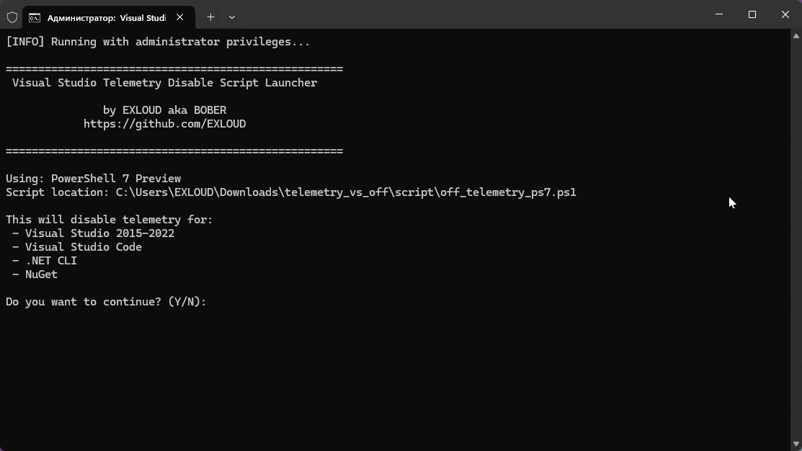

<div align="center">

# Visual Studio Telemetry Disable Tool

### 👀 Repository Views


**⭐ If this tool helped you, please consider giving it a star! ⭐**

---

[](https://github.com/PowerShell/PowerShell)
[](LICENSE)




A comprehensive PowerShell-based tool to disable telemetry and data collection across Microsoft development tools including Visual Studio, Visual Studio Code, .NET CLI, and NuGet.

</div>

## 🚀 Features

- **Comprehensive Coverage**: Disables telemetry for Visual Studio 2015-2022, VS Code, .NET CLI, and NuGet
- **Backup & Restore**: Create registry backups before making changes and restore when needed
- **Smart Detection**: Only modifies existing registry paths - doesn't create unnecessary entries
- **PowerShell 7 Optimized**: Enhanced performance and modern PowerShell features
- **Administrator Safety**: Requires admin privileges and validates permissions
- **Cross-Version Support**: Works with PowerShell 5.1 and 7.0+
- **Detailed Logging**: Color-coded output with comprehensive status reporting

## 📋 What Gets Disabled

### Visual Studio (2015-2022)
- Customer Experience Improvement Program (CEIP)
- Feedback dialogs and crash reporting
- Automatic data collection
- VS Standard Collector Service

### Visual Studio Code
- Telemetry reporting
- Crash reporter
- Automatic experiments
- Extension auto-updates
- Usage analytics

### .NET CLI & NuGet
- .NET CLI telemetry collection
- NuGet package usage analytics
- Performance data collection

### System-Wide
- Windows SQM (Software Quality Metrics) Client
- Application Insights data collection
- Telemetry directories cleanup

## 🛠️ Prerequisites

- Windows operating system
- Administrator privileges
- PowerShell 5.1 or PowerShell 7.0+

## 📦 Installation

1. **Download the tool:**
   ```bash
   git clone https://github.com/your-username/vs-telemetry-disable.git
   cd vs-telemetry-disable
   ```

2. **Or download as ZIP:**
   - Click "Code" → "Download ZIP"
   - Extract to your desired location

## 🚀 Usage

### Quick Start

1. **Right-click on `Launcher.bat`** and select **"Run as administrator"**
2. Follow the interactive prompts
3. The launcher will automatically detect your PowerShell version and run the appropriate script

### Command Line Usage

#### Basic Usage (Disable telemetry)
```powershell
# PowerShell 7
.\script\off_telemetry_ps7.ps1

# PowerShell 5
.\script\off_telemetry_ps5.ps1
```

#### Create Backup First (Recommended)
```powershell
# Create backup before making changes
.\script\off_telemetry_ps7.ps1 -CreateBackup

# Create backup to specific location
.\script\off_telemetry_ps7.ps1 -CreateBackup -BackupPath "C:\MyBackups\telemetry_backup.reg"
```

#### Restore from Backup
```powershell
# Restore from default backup location
.\script\off_telemetry_ps7.ps1 -RestoreBackup -BackupPath "path\to\your\backup.reg"
```

### Advanced Usage Examples

```powershell
# Create backup and continue with telemetry disable
.\script\off_telemetry_ps7.ps1 -CreateBackup

# Restore specific backup file
.\script\off_telemetry_ps7.ps1 -RestoreBackup -BackupPath "C:\Backups\telemetry_backup_20241201_143022.reg"

# Create backup to custom location without running disable
.\script\off_telemetry_ps7.ps1 -CreateBackup -BackupPath "D:\MyBackups\vs_telemetry.reg"
```

## 📁 Project Structure

```
vs-telemetry-disable/
├── Launcher.bat              # Interactive launcher script
├── assets/
│   └── preview.gif           # Tool demonstration
├── script/
│   ├── off_telemetry_ps7.ps1 # PowerShell 7.0+ version
│   └── off_telemetry_ps5.ps1 # PowerShell 5.1 version
├── README.md                 # This file
├── LICENSE                   # MIT License
└── .gitignore               # Git ignore rules
```

## 🔧 How It Works

### Detection Process
1. **PowerShell Version Detection**: Launcher automatically detects available PowerShell versions
2. **Registry Path Validation**: Only existing registry paths are modified
3. **Service Management**: Safely stops and disables telemetry services
4. **Environment Variables**: Sets opt-out environment variables
5. **File Cleanup**: Removes existing telemetry data directories

### Registry Modifications
The tool modifies the following registry areas (only if they exist):
- `HKLM:\SOFTWARE\Microsoft\VSCommon\*\SQM`
- `HKLM:\SOFTWARE\Policies\Microsoft\VisualStudio`
- `HKCU:\Software\Microsoft\VisualStudio`
- `HKLM:\SOFTWARE\Microsoft\SQMClient`

### Environment Variables Set
- `DOTNET_CLI_TELEMETRY_OPTOUT=1`
- `NUGET_TELEMETRY_OPTOUT=true`
- `POWERSHELL_TELEMETRY_OPTOUT=1`

## ⚠️ Important Notes

- **Administrator Rights Required**: The script must run with administrator privileges
- **Backup Recommended**: Always create a backup before making changes
- **Restart Required**: Some changes may require a system restart to take full effect
- **Existing Paths Only**: The script only modifies existing registry entries
- **VS Code Settings**: Creates/updates VS Code settings.json with privacy-focused configuration

## 🔄 Backup & Restore

### Creating Backups
```powershell
# Default backup location (Desktop with timestamp)
.\script\off_telemetry_ps7.ps1 -CreateBackup

# Custom backup location
.\script\off_telemetry_ps7.ps1 -CreateBackup -BackupPath "C:\Backups\my_backup.reg"
```

### Restoring Backups
```powershell
# Restore from backup
.\script\off_telemetry_ps7.ps1 -RestoreBackup -BackupPath "path\to\backup.reg"
```

Backup files are standard Windows Registry (.reg) files that can be imported manually if needed.

## 🆘 Troubleshooting

### Common Issues

**"This script must be run as Administrator"**
- Right-click the batch file and select "Run as administrator"
- Or run PowerShell as administrator and execute the script directly

**"PowerShell script not found"**
- Ensure the `script` folder contains the PowerShell files
- Check that file paths are correct

**"No compatible PowerShell version found"**
- Install PowerShell 7 (recommended) or ensure Windows PowerShell 5.1 is available

### Verification

To verify the changes worked:
1. Check environment variables in a new command prompt
2. Look for disabled services in Services.msc
3. Check VS Code settings.json for updated privacy settings
4. Review registry entries (if comfortable with registry editing)

## 🤝 Contributing

Contributions are welcome! Please feel free to submit a Pull Request. For major changes, please open an issue first to discuss what you would like to change.

### Development Setup
1. Fork the repository
2. Create a feature branch (`git checkout -b feature/amazing-feature`)
3. Make your changes
4. Test on both PowerShell 5.1 and 7.0+
5. Commit your changes (`git commit -m 'Add amazing feature'`)
6. Push to the branch (`git push origin feature/amazing-feature`)
7. Open a Pull Request

## 📄 License

This project is licensed under the MIT License - see the [LICENSE](LICENSE) file for details.

## ⚡ Author

**EXLOUD**

## 🙏 Acknowledgments

- Microsoft for providing comprehensive documentation on registry settings
- PowerShell community for best practices and patterns
- Contributors and users who provide feedback and improvements

## 📊 Compatibility

<div align="center">

| Component | Status | Notes |
|-----------|--------|-------|
| Visual Studio 2015 | ✅ Supported | If installed |
| Visual Studio 2017 | ✅ Supported | If installed |
| Visual Studio 2019 | ✅ Supported | If installed |
| Visual Studio 2022 | ✅ Supported | If installed |
| Visual Studio Code | ✅ Supported | If installed |
| .NET CLI | ✅ Supported | Always processed |
| NuGet | ✅ Supported | Always processed |
| PowerShell 5.1 | ✅ Supported | Windows PowerShell |
| PowerShell 7.0+ | ✅ Supported | Recommended |

</div>

## 🔮 Roadmap

- [ ] GUI interface for easier usage
- [ ] Support for additional Microsoft development tools
- [ ] Scheduled telemetry cleanup
- [ ] Configuration profiles for different scenarios
- [ ] Integration with package managers

---


**⭐ If this tool helped you, please consider giving it a star!**
